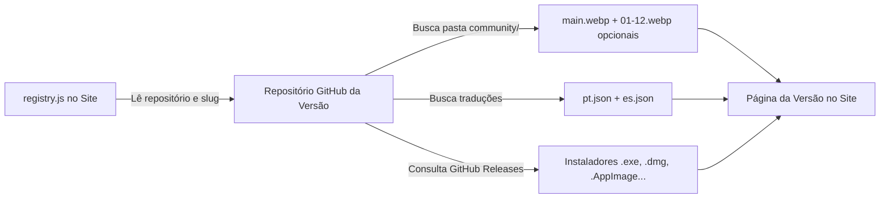

# 🤝 Guia de Integração de Versões da Comunidade — Louvor JA

Este guia descreve o processo e os requisitos técnicos para que uma nova versão da comunidade seja homologada, integrada e exibida automaticamente no portal oficial do **Louvor JA** ([louvorja.com.br/comunidade](https://louvorja.com.br/comunidade)).

---

## 📋 Índice

1. [Visão Geral do Fluxo](#1-visão-geral-do-fluxo)
2. [Etapa 1: Cadastro no `registry.js` (Site Oficial)](#2-etapa-1-cadastro-no-registryjs-site-oficial)
3. [Etapa 2: Estrutura da Pasta `community/` no Repositório da Versão](#3-etapa-2-estrutura-da-pasta-community-no-repositório-da-versão)
4. [Etapa 3: Imagens (`.webp`)](#4-etapa-3-imagens-webp)
5. [Etapa 4: Arquivos de Tradução (`pt.json` e `es.json`)](#5-etapa-4-arquivos-de-tradução-ptjson-e-esjson)
6. [Etapa 5: Releases e Instaladores no GitHub](#6-etapa-5-releases-e-instaladores-no-github)
7. [Checklist de Homologação](#7-checklist-de-homologação)

---

## 1. Visão Geral do Fluxo

O portal do Louvor JA consome os dados das versões da comunidade de forma **desacoplada e dinâmica**:



1. A versão é cadastrada no arquivo `src/versions/registry.js` deste repositório.
2. O site busca dinamicamente no repositório remoto os dados e assets da pasta `community/`.
3. O carregador valida estritamente a presença de `main.webp`, se todos os campos de `pt.json` e `es.json` estão preenchidos e se o campo `name` é idêntico ao `codename`.
4. Estando tudo correto, a versão passa a ter sua própria página pública (`/comunidade/:slug`) com instaladores, tema personalizado e galeria.

---

## 2. Etapa 1: Cadastro no `registry.js` (Site Oficial)

O arquivo `src/versions/registry.js` é a **única fonte de verdade** para cadastrar, ativar ou desativar versões no site.

Para adicionar uma nova versão, inclua um novo objeto no array `registeredVersions`:

```js
export const registeredVersions = [
  {
    slug: "minha-versao",                     // Identificador único (URL: /comunidade/minha-versao)
    codename: "MinhaVersao",                  // Codinome oficial de exibição
    repo: "usuario-ou-org/nome-do-repo",      // Repositório GitHub (usuario/repositorio)
    branch: "main",                           // Branch onde estão os arquivos (padrão: "main")
    folder: "community",                      // Pasta na raiz do repo (padrão: "community")
    color: "#0084c1",                         // Cor temática oficial em HEX
    stage: "Beta",                            // Estágio: "Alpha", "Beta", "RC" ou "Estável"
    platforms: ["windows", "mac", "linux"],   // Sistemas operacionais suportados
    enabled: true,                            // true = visível | false = oculta
  },
];
```

### Detalhamento dos Campos

| Campo | Tipo | Obrigatório | Descrição |
|---|---|:---:|---|
| `slug` | `String` | **Sim** | Identificador único em minúsculas, usado na URL da rota (`/comunidade/:slug`). |
| `codename` | `String` | **Sim** | Nome oficial do codinome musical (ex: `Flute`, `Piano`, `Violin`). **Deve ser exatamente igual ao campo `name` do `pt.json` e `es.json`.** |
| `repo` | `String` | **Sim** | Caminho do repositório no GitHub (`usuario/repositorio`). |
| `branch` | `String` | Não | Branch de publicação onde estão os arquivos (padrão: `"main"`). |
| `folder` | `String` | Não | Nome da pasta na raiz do repositório (padrão: `"community"`). |
| `color` | `String` | **Sim** | Cor primária da versão em formato HEX (ex: `"#0084C1"`). O site calcula fundos, bordas e contraste matematicamente. |
| `stage` | `String` | **Sim** | Fase atual do projeto: `"Alpha"`, `"Beta"`, `"RC"` ou `"Estável"`. |
| `platforms` | `Array` | **Sim** | Sistemas com suporte: combinação de `["windows", "mac", "linux"]`. |
| `enabled` | `Boolean`| **Sim** | `true` para exibir no portal; `false` para manter cadastrado porém oculto. |

---

## 3. Etapa 2: Estrutura da Pasta `community/` no Repositório da Versão

Na **raiz** do repositório indicado em `repo`, crie a pasta com o nome informado em `folder` (por padrão: `community/`).

### Árvore de Arquivos

```
seu-repositorio/
└── community/
    ├── pt.json           # Textos e especificações em Português (OBRIGATÓRIO)
    ├── es.json           # Textos e especificações em Espanhol (OBRIGATÓRIO)
    ├── main.webp         # Imagem principal / mockup de apresentação (OBRIGATÓRIO)
    │
    │   # Capturas de tela para a galeria (OPCIONAIS - Máximo de 12 imagens)
    ├── 01.webp           # Captura de tela 01 (opcional)
    ├── 02.webp           # Captura de tela 02 (opcional)
    ├── 03.webp           # Captura de tela 03 (opcional)
    ├── ...
    └── 12.webp           # Captura de tela 12 (opcional)
```

> ⚠️ **Regra Estrita de Carregamento:** Se `pt.json`, `es.json` ou `main.webp` estiverem ausentes, ou se os arquivos de tradução não passarem na validação estrita (campos em branco ou `name` divergente), o site **NÃO carregará** a versão.

---

## 4. Etapa 3: Imagens (`.webp`)

Para garantir máxima performance, carregamento veloz e baixo consumo de dados, **todas as imagens devem obrigatoriamente ter a extensão `.webp`**.

### Requisitos das Imagens

| Arquivo | Obrigatório? | Quantidade | Dimensões Recomendadas | Descrição |
|---|:---:|:---:|---|---|
| **`main.webp`** | **SIM** | 1 | `1200 x 800 px` ou `1920 x 1080 px` | Imagem principal de apresentação (mockup do software). Exibida em destaque no topo da página de detalhes. |
| **`01.webp` a `12.webp`** | **NÃO** | 0 a 12 | `1920 x 1080 px` (16:9) | Capturas de tela do aplicativo em uso. São **opcionais**: você pode colocar 0 imagens, 3 imagens ou até o limite máximo de 12 imagens. Se presentes, aparecem na galeria e no visualizador ampliado (lightbox). |

### Regras das Imagens:
- **Extensão estrita:** Somente `.webp`. Arquivos `.png`, `.jpg` ou `.jpeg` são ignorados pelo sistema.
- **Nomenclatura das capturas:** Devem seguir o padrão sequencial com dois dígitos: `01.webp`, `02.webp`, ..., `12.webp`.
- **Limite máximo:** O sistema busca no máximo 12 capturas (`01` a `12`).
- **Otimização:** Recomenda-se manter o tamanho de cada imagem abaixo de 350 KB para navegação rápida em conexões móveis.

---

## 5. Etapa 4: Arquivos de Tradução (`pt.json` e `es.json`)

Dentro da pasta `community/`, devem existir **obrigatoriamente** os arquivos `pt.json` (Português) e `es.json` (Espanhol).

> 🛑 **ATENÇÃO ÀS DUAS REGRAS OBRIGATÓRIAS DE VALIDAÇÃO:**
> 1. **Correspondência Exata do Nome:** O valor da chave `"name"` deve ser **rigorosamente idêntico** ao `"codename"` cadastrado no `src/versions/registry.js` do site (incluindo maiúsculas e minúsculas). Exemplo: se no registry está `"codename": "Violin"`, no JSON deve estar obrigatoriamente `"name": "Violin"`.
> 2. **Todos os Campos Preenchidos:** **TODOS** os 28 campos listados abaixo devem estar preenchidos com texto válido (nenhum pode ser deixado em branco, vazio `""` ou ausente). Se qualquer campo estiver faltando ou em branco, o site **não vai carregar a versão**.

---

### Exemplo de Estrutura de Dados Padrão (Dados Fictícios de Demonstração)

Abaixo está o modelo completo preenchido com dados demonstrativos fictícios:

```json
{
  "name": "NomeDoCodename",
  "subtitle": "SUBTÍTULO EM DESTAQUE OU SLOGAN DA VERSÃO",
  "short_desc": "Breve resumo da versão em uma ou duas frases, utilizado no card da página principal de versões da comunidade.",
  "overview_desc": "Descrição completa e detalhada da versão para a página de detalhes. Explique aqui a proposta do aplicativo, sua arquitetura técnica, as tecnologias utilizadas e os diferenciais que ele entrega para igrejas e operadores de som/projeção.",
  
  "feature1_icon": "fa fa-music",
  "feature1_title": "Título do Primeiro Recurso",
  "feature1_desc": "Explicação detalhada sobre o primeiro grande diferencial da versão (ex: biblioteca de músicas, sincronização, etc.).",
  
  "feature2_icon": "fa fa-desktop",
  "feature2_title": "Título do Segundo Recurso",
  "feature2_desc": "Explicação detalhada sobre o segundo diferencial (ex: suporte a múltiplos monitores, saídas NDI, design moderno, etc.).",
  
  "feature3_icon": "fa fa-bolt",
  "feature3_title": "Título do Terceiro Recurso",
  "feature3_desc": "Explicação detalhada sobre o terceiro diferencial (ex: alta velocidade, inicialização instantânea, leveza).",
  
  "feature4_icon": "fa fa-check-circle",
  "feature4_title": "Título do Quarto Recurso",
  "feature4_desc": "Explicação detalhada sobre o quarto diferencial (ex: compatibilidade multiplataforma, instaladores nativos).",
  
  "req_os_min": "Windows 10 (64-bit), macOS 11 Big Sur ou Linux 64-bit",
  "req_os_rec": "Windows 11 (64-bit), macOS 13+ (Apple Silicon/Intel) ou Linux recente",
  "req_cpu_min": "Processador Dual-Core 2.0 GHz ou superior",
  "req_cpu_rec": "Processador Quad-Core 2.5 GHz ou Apple Silicon",
  "req_ram_min": "4 GB de memória RAM livre",
  "req_ram_rec": "8 GB a 16 GB de RAM para multitarefa e streaming",
  "req_gpu_min": "Placa de vídeo integrada compatível com aceleração por hardware",
  "req_gpu_rec": "Placa de vídeo dedicada com 2 GB VRAM ou superior",
  "req_disk_min": "2 GB de espaço livre em disco",
  "req_disk_rec": "15 GB de espaço livre em SSD (para arquivos locais de mídia)",
  "req_screens_min": "1 tela com resolução mínima de 1366 × 768",
  "req_screens_rec": "2 telas (área estendida) com resolução Full HD 1920 × 1080"
}
```

### Tabela de Campos Obrigatórios

| Campo | Obrigatório? | Regra / Descrição |
|---|:---:|---|
| `name` | **SIM** | **Obrigatório ser idêntico ao `codename` do `registry.js`.** |
| `subtitle` | **SIM** | Slogan ou subtítulo em caixa alta ou destaque. |
| `short_desc` | **SIM** | Descrição curta para o card da listagem (`/comunidade`). |
| `overview_desc` | **SIM** | Visão geral completa para o topo da página individual da versão. |
| `feature1_icon` a `feature4_icon` | **SIM** | Classe de ícone Font Awesome 4 (ex: `fa fa-music`, `fa fa-desktop`, `fa fa-bolt`, `fa fa-check-circle`, `fa fa-language`, `fa fa-cubes`). |
| `feature1_title` a `feature4_title` | **SIM** | Título de cada um dos 4 cards de recursos. |
| `feature1_desc` a `feature4_desc` | **SIM** | Texto explicativo dos 4 recursos em destaque. |
| `req_os_min` / `req_os_rec` | **SIM** | Sistema operacional mínimo e recomendado. |
| `req_cpu_min` / `req_cpu_rec` | **SIM** | Processador mínimo e recomendado. |
| `req_ram_min` / `req_ram_rec` | **SIM** | Memória RAM mínima e recomendada. |
| `req_gpu_min` / `req_gpu_rec` | **SIM** | Placa de vídeo mínima e recomendada. |
| `req_disk_min` / `req_disk_rec` | **SIM** | Espaço em disco mínimo e recomendado. |
| `req_screens_min` / `req_screens_rec` | **SIM** | Telas e resolução mínima e recomendada. |

---

## 6. Etapa 5: Releases e Instaladores no GitHub

O portal do Louvor JA não hospeda instaladores localmente. Todos os botões de download são **gerados dinamicamente via GitHub Releases**.

### Reconhecimento Automático de Extensões:
Ao criar uma Release no repositório GitHub com os binários anexados, o site inspeciona os arquivos da última release e monta os botões automaticamente:

- **Windows:** Arquivos `.exe` (instalador padrão), `.msi` ou `.zip`.
- **macOS:** Arquivos `.dmg` (diferenciando `arm64`/`arm` e `x64`/`intel`), `.pkg`.
- **Linux:** Arquivos `.AppImage`, `.deb`, `.rpm`, `.tar.gz`.

### Destaque por Sistema Operacional:
O site detecta o sistema operacional do visitante:
- O card do sistema do usuário recebe a badge **`★ RECOMENDADO`** flutuando sobre a borda superior.
- A opção de download específica mais recomendada (ex: `.exe` no Windows, `.dmg (ARM)` no Mac com chip Apple Silicon, `.AppImage` no Linux) recebe destaque direto no botão.

---

## 7. Checklist de Homologação

Antes de publicar ou solicitar a homologação da versão, revise os itens:

- [ ] O repositório está acessível publicamente no GitHub.
- [ ] A versão está registrada em `src/versions/registry.js` com `enabled: true`.
- [ ] A pasta `community/` está criada na raiz da branch indicada.
- [ ] O arquivo `main.webp` está presente na pasta `community/`.
- [ ] *(Opcional)* As capturas de tela estão nomeadas de `01.webp` até no máximo `12.webp`.
- [ ] Todas as imagens usam estritamente a extensão `.webp`.
- [ ] Os arquivos `pt.json` e `es.json` existem e contêm JSONs válidos.
- [ ] O campo `"name"` no `pt.json` e `es.json` é **rigorosamente idêntico** ao `"codename"` de `registry.js`.
- [ ] **Todos os 28 campos** do `pt.json` e `es.json` estão preenchidos (sem campos vazios).
- [ ] Existe pelo menos uma Release pública no GitHub com os instaladores anexados nos assets.

Atendendo a todos os requisitos, a versão será carregada e exibida no portal imediatamente!
